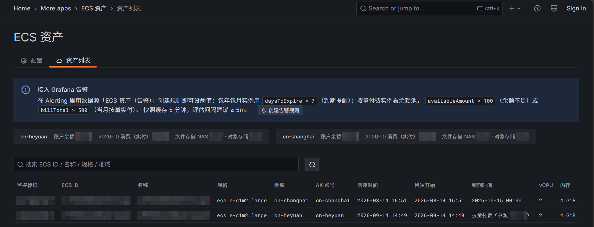
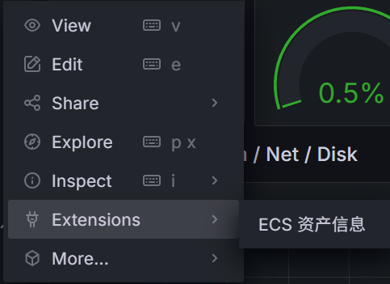
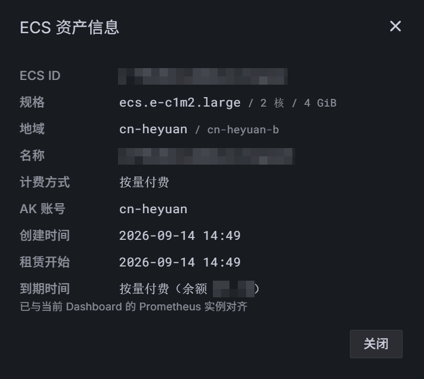
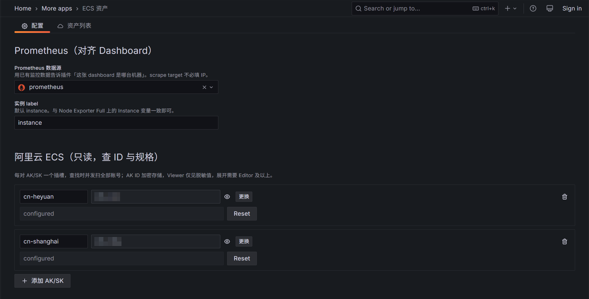

<div align="center">


# ECS 资产 · Grafana App Plugin

**让每一块监控面板，都知道自己盯的是哪台云服务器。**

把阿里云 ECS 的身份、规格、租期与账单，接进你已经在用的 Prometheus + Grafana。


</div>

<p align="center"></p>

---

## 为什么做它

Prometheus + Node Exporter 的看板能告诉你「这台机器 CPU 90%」，却回答不了接下来最自然的几个问题：

- **它是哪台 ECS？几核几 G？** 看板上只有 `instance=web-01`，实例 ID、规格、地域都在阿里云控制台里，得拿主机名或 IP 去一个个地域翻。
- **它什么时候到期？账户还有多少钱？** 包年包月忘续费会停机，按量付费余额见底会停服——这些信息散落在费用中心，不在运维每天盯着的 Grafana 里。
- **资产在好几个账号下怎么办？** 多个阿里云账号、多个 RAM 用户，各看各的控制台，对账成本成倍增加。

为了这几个问题再引一套 CMDB 太重，脚本导出的表格很快过期，把 IP 贴进看板又埋下安全隐患。

**ECS 资产的思路是不造新的数据孤岛**：Prometheus 继续负责「哪台机器」，插件负责「它是谁」，Grafana 负责展示和告警。装上即用，不改 scrape 配置、不加数据库、不碰已有看板。

## 技术栈

| 层     | 选型                                                                   | 说明                                                                |
| ------ | ---------------------------------------------------------------------- | ------------------------------------------------------------------- |
| 前端   | React 18 · TypeScript · `@grafana/ui` / `@grafana/runtime` · Emotion   | 全部使用 Grafana 原生组件与主题，深浅色自动适配                     |
| 后端   | Go 1.26 · `grafana-plugin-sdk-go`                                      | 官方推荐的 ServeMux + httpadapter 结构                              |
| 云 API | 自研阿里云 RPC 签名（HMAC-SHA1）                                       | 零阿里云 SDK 依赖，直连 ECS 与费用中心（BSS）OpenAPI                |
| 告警   | 捆绑后端数据源 · Grafana Unified Alerting                              | app 与数据源双进程，资产数据直通告警引擎                            |
| 权限   | Grafana RBAC · `grafana/authlib`                                       | 三档自定义权限，前后端权限常量由同一份 `plugin.json` 生成           |
| 存储   | Grafana `secureJsonData`                                               | 凭证加密落库，无需外部数据库                                        |
| 质量   | Go test（`-race`）· Playwright e2e · golangci-lint · ESLint / Prettier | 安全红线与关键交互固化为自动化回归，GitHub Actions 每次推送全量执行 |

## 功能

### 监控面板与云资产自动对齐

**解决**：看板上的机器标识和云上实例对不上号。

插件从 Prometheus 读取被监控机器的标识（`instance` / `nodename`），后端用 AccessKey 并发扫描该账号的全部地域，按实例 ID → IP → 主机名 → 实例名的优先级**唯一命中**。scrape target 不用改成 IP，主机名就能对上。

对齐结果宁缺毋滥：同名机器跨地域撞车时标注「未匹配」并写明原因，绝不猜一个；同一账号内任一地域查询失败就整体报错，不会静默少列一台（RAM 策略未授权的地域按授权边界跳过，见下文「最小权限」）。

### 在面板菜单里一键查看

**解决**：盯着 CPU 曲线想知道机器规格，还得切出去翻控制台。

任意看板的面板菜单 → Extensions → **ECS 资产信息**，按当前看板变量实时解析，弹窗直接给出实例 ID、规格、地域与租期。

<p align="center">


</p>

### 资产全景与账户概览

**解决**：机器身份、租期、花费分散在三四个控制台页面里。

资产列表页为每台被监控机器列出监控标识、ECS ID、名称、规格（vCPU / 内存）、地域、创建时间、租赁开始与到期时间，汇总成一张可搜索的表。租赁开始取自费用中心的订单开通时间，与实例创建时间并列展示。

列表上方是账户概览（多账号时每个账号一栏）：**余额 · 代金券 · 当月实付 · 消费 Top 产品**，没有代金券或当月消费时对应项自动隐藏。按量付费没有到期日，余额就是它的续命线，所以按量实例的到期列直接显示「按量付费（余额 ¥x）」。财务数据仅 Editor / Admin 可见。

### 到期与余额告警，原生接入 Grafana Alerting

**解决**：忘续费停机、余额耗尽停服，本该提前知道。

插件内置一个专用数据源，把资产快照转换成告警引擎能直接评估的时间序列。在 Grafana Alerting 里像配置任何指标一样建规则，复用已有的联系人和通知策略：

| 指标              | 守护对象     | 规则示例                  |
| ----------------- | ------------ | ------------------------- |
| `daysToExpire`    | 包年包月实例 | `< 7`：到期前一周提醒续费 |
| `availableAmount` | 账户余额池   | `< 100`：余额不足预警     |
| `billTotal`       | 按量付费实例 | `> 500`：当月花费超出预算 |

到期序列带 `instanceId` / `name` / `type` / `region` / `chargeType` 标签，所有序列都带来源账号 `ak` / `akLabel`，可直接用于通知路由。资产页顶部的引导卡一键跳转建规则。

<!-- 截图待补：Alerting 规则编辑器里预览 daysToExpire 序列 -->

### 多账号并发查找

**解决**：资产分散在多个阿里云账号或 RAM 用户下。

配置页最多可添加 50 对 AK/SK，查找时并发扫描所有账号。每个账号独立缓存、独立降级：一把凭证失效，其余账号的资产和告警照常工作。同一台机器如果在两个账号下同时命中，插件标为「未匹配」并注明跨账号歧义，而不是替你选一个。资产列表和告警序列都会标出来源账号。

<p align="center"></p>

### 最小权限，可按地域授权

**解决**：不想给一个监控插件整个账号的读权限。

ECS 部分只需 `ecs:DescribeRegions` + `ecs:DescribeInstances` 两项只读权限；账户概览与账单告警再加费用中心四项，缺了只是对应功能降级，资产对齐不受影响。

RAM 策略还可以**按地域收束**：插件把被拒绝的地域识别为这把 AK 的可见边界，只在授权地域内枚举。比如一把 AK 只授权杭州、另一把只授权北京，两把凭证看到的资产各归各位、互不越界。（阿里云的实例列表接口不支持逐实例鉴权，所以授权粒度最细到地域。）

### 安全是默认值

- **IP 不出后端**：内网与公网 IP 只在后端用于匹配，浏览器和告警数据都拿不到，由自动化测试守护。
- **凭证加密存储**：AK ID 与 Secret 都存在 Grafana 加密字段里，Viewer 只能看到脱敏的 AK（前 3 位 + 后 3 位）。
- **三档权限**：查看（Viewer）· 查看完整 AK、账单与连通测试（Editor）· 修改配置（Admin）。

### 快，而且不旧

5 分钟 stale-while-revalidate 缓存：热路径毫秒级返回；缓存过期时先返回旧数据、后台静默刷新；需要最新数据时，点刷新按钮即可强制实时拉取。

## 工作原理

```
 Prometheus                     插件后端                          阿里云
 ──────────                     ────────                          ──────
 instance / nodename ──────▶  全地域并发枚举 · 唯一命中  ◀──────▶  ECS OpenAPI
 「哪台机器」                  IP 只留在这里                       费用中心 BSS
                              5 分钟 SWR 缓存（按账号分片）
                                     │
                      ┌──────────────┴──────────────┐
                      ▼                             ▼
             资产列表 / 面板弹窗              捆绑数据源 → Grafana Alerting
             （只见 ID · 规格 · 租期）        （到期 · 余额 · 账单告警）
```

## 快速开始

**环境要求**：Grafana ≥ 11.6、已接入 Node Exporter 的 Prometheus 数据源、一把阿里云只读 AccessKey；构建需要 Node.js 22、Go 1.26 与 Docker。

```bash
npm install
npm run build
cp .env.example .env   # 填入随机 GF_SECURITY_SECRET_KEY，留空则凭证用 Grafana 公开默认密钥加密
docker compose up -d
```

打开 <http://localhost:3000> → More apps → **ECS 资产**：

1. **配置**：选择已有的 Prometheus 数据源，确认实例 label（默认 `instance`）。
2. **添加 AK/SK**：可以添加多对，保存后点「测试连接」，逐个账号显示可见的实例数与地域数。
3. **开始使用**：切到「资产列表」，或在任意看板的面板菜单打开「ECS 资产信息」。

### 推荐的 RAM 权限策略

```json
{
  "Version": "1",
  "Statement": [
    { "Effect": "Allow", "Action": "ecs:DescribeRegions", "Resource": "*" },
    { "Effect": "Allow", "Action": "ecs:DescribeInstances", "Resource": "*" },
    {
      "Effect": "Allow",
      "Action": [
        "bssopenapi:QueryAccountBalance",
        "bssopenapi:QueryCashCoupons",
        "bssopenapi:QueryInstanceBill",
        "bssopenapi:QueryAvailableInstances"
      ],
      "Resource": "*"
    }
  ]
}
```

- **按地域收束**：把 `DescribeInstances` 的 `Resource` 换成 `["acs:ecs:cn-hangzhou:*:*"]`（可多条并列）；`DescribeRegions` 是账号级接口，必须保持 `"*"`。
- **授权范围请选「整个云账号」**：挂在资源组上会让 `"*"` 被收窄成组内实例，列表接口会全部被拒。

## 开发

```bash
npm run build                    # 生成权限常量 + 前端 + 后端双二进制
npm run lint && npx tsc --noEmit # 前端检查
go vet ./... && go test ./...    # 后端检查
npm run e2e                      # Playwright 端到端回归
```

插件 ID `local-ecs-app`，当前未签名，开发环境需在 Grafana 中允许加载未签名插件（`docker-compose.yaml` 已配置）。架构分层、安全红线与踩坑记录见 [AGENTS.md](AGENTS.md)，版本变更见 [CHANGELOG.md](CHANGELOG.md)。

## 许可证

[Apache-2.0](LICENSE)
